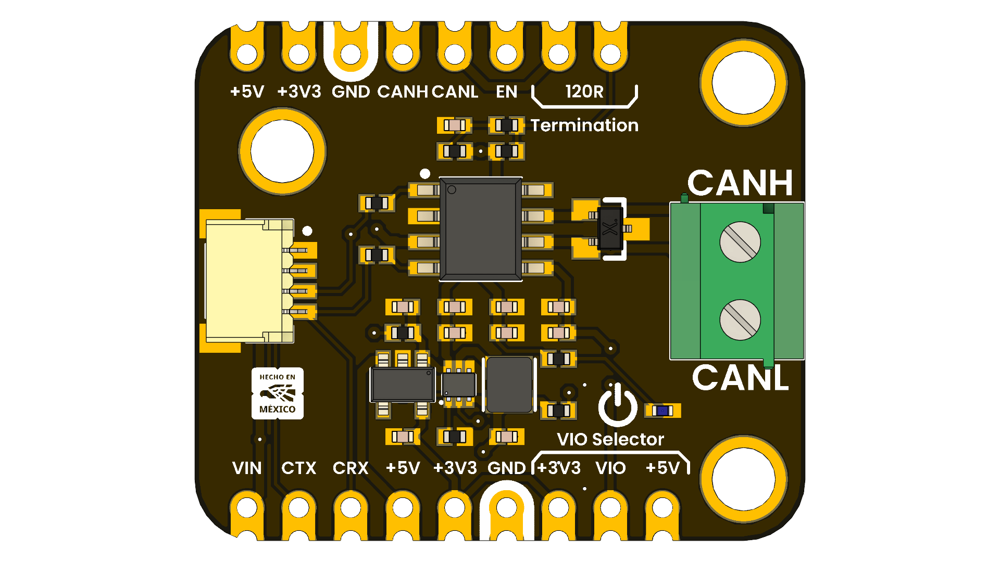

# DevLab: TCAN1051HVD CAN Transceiver Module

## Introduction

The TCAN1051HVD is a high-speed CAN transceiver designed for automotive and industrial applications. It provides a robust interface between a CAN controller and the physical CAN bus, ensuring reliable data transmission in harsh environments. This module is ideal for use in electric vehicles, industrial automation, and other applications requiring reliable CAN communication.

  
  
  
  
   

  
  
<em>TCAN1051HVD</em>

### Quick Setup

## Overview

| Feature / Component              | Detailed Description                                                                                                                     |
| -------------------------------- | ---------------------------------------------------------------------------------------------------------------------------------------- |
| **Communication**                | Integrated **high-speed CAN (Controller Area Network) interface**, ensuring robust and reliable data transfer in demanding environments. |
| **Operating Voltage**            | Supports both **3.3V and 5V logic levels**, making it adaptable to a wide range of microcontrollers and external systems.                |
| **Input Port**                   | **JST 1.0 mm 4-pin connector** providing a compact and secure interface for supplying power and CAN signals.                             |
| **IC1 – TCAN1051HVD**            | Automotive-grade **CAN transceiver IC**, designed for high noise immunity, ESD protection, and reliable long-distance communication.     |
| **IC2 – AP2112K**                | **3.3V low dropout (LDO) regulator**, delivering a clean and stable voltage supply to sensitive components.                              |
| **IC3 – TPS61023**               | High-efficiency **5V boost converter**, enabling stable power delivery even from lower input voltages.                                   |
| **L1 – Power LED**               | On-board LED indicator that provides **instant visual feedback of power status**.                                                        |
| **JP1 / JP2**                    | Dual rows of **2.54 mm castellated holes** (side 1 and 2), allowing flexible mounting, soldering, or integration into custom boards.     |
| **J1 – CAN Data Port**           | **Dedicated JST 1.0 mm pitch connector** optimized for reliable CAN bus data line interfacing.                                           |
| **J2 – Screw Terminal**          | Sturdy **terminal block** that allows secure, tool-based connection to the CAN bus wiring.                                               |
| **SB1 – Logic Voltage Selector** | **Configurable solder bridge** for selecting the appropriate logic voltage (VIO), ensuring compatibility with the host system.           |

## Applications

- Automotive systems
- Robotics
- Home automation
- IoT devices

## License

This product and its documentation are licensed under the MIT License.  
See [`LICENSE.md`](LICENSE.md) for details.

  Template by UNIT Electronics • Customize this file for your product documentation.

