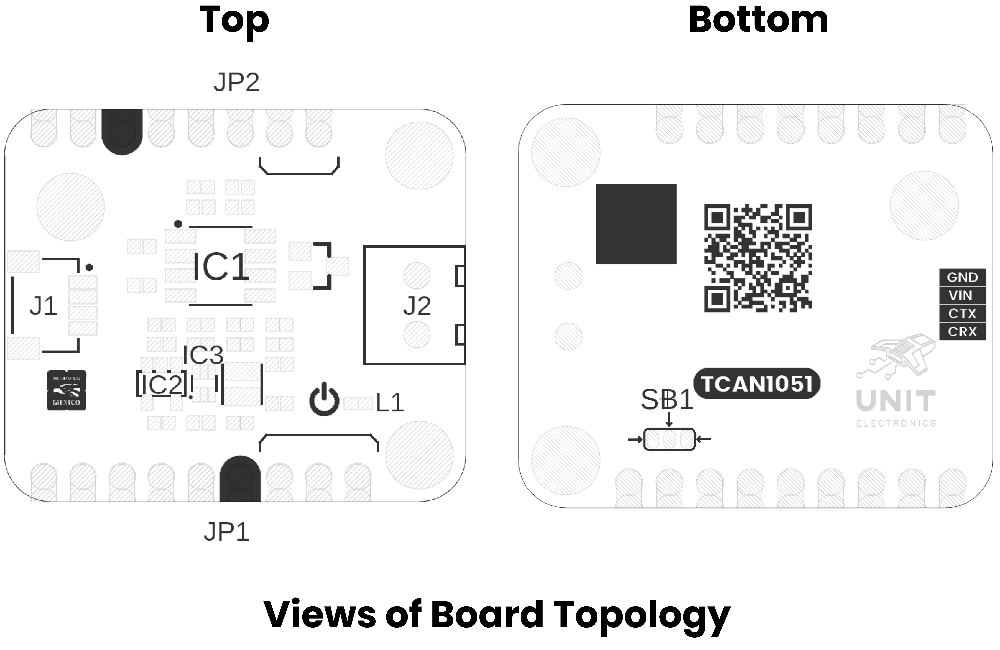

# Hardware

<a href="./unit_schematic_v_1_0_ue0085_TCAN1051HVD.pdf">  Schematics</a>

## Technical Specifications

| **Parameter** |                    **Description**                     | **Min** |   **Typ**   | **Max** | **Unit** |
|:-------------:|:------------------------------------------------------:|:-------:|:-----------:|:-------:|:--------:|
|      VIN      |              Module power input voltage              |   3.3   |      -      |   5.0   |    V     |
|      VCC      |            TCAN1051HVD bus supply voltage             |   4.5   |     5.0     |   5.5   |    V     |
|      VIO      |            I/O level-shifting supply voltage          |   2.8   |  3.3 / 5.0  |   5.5   |    V     |
|    IO(CRX)    |          Recommended CRX output-current range         |   -2    |      -      |    2    |    mA    |
|      VIH      |              CTX input HIGH-level voltage             | 0.7xVIO |      -      |    -    |    V     |
|      VIL      |              CTX input LOW-level voltage              |    -    |      -      | 0.3xVIO |    V     |
|      VOH      |              CRX output HIGH-level voltage            | 0.8xVIO |      -      |    -    |    V     |
|      VOL      |              CRX output LOW-level voltage             |    -    |      -      | 0.2xVIO |    V     |
|  VO(DOM)-H    |            CANH bus output voltage, dominant           |  2.75   |      -      |   4.5   |    V     |
|  VO(DOM)-L    |            CANL bus output voltage, dominant           |   0.5   |      -      |  2.25   |    V     |
|   VOD(DOM)    |      Differential output, dominant, 50 to 65 Ω load   |   1.5   |      -      |   3.0   |    V     |
|      VCM      |               Receiver common-mode range              |   -30   |      -      |   30    |    V     |
|    CAN FD     |       Supported data rate for the HVD transceiver      |    -    |      -      |    2    |   Mbps   |
|      TA*      |        TCAN1051HVD operating free-air temperature      |   -55   |      -      |   125   |    °C    |

*VIN is a module-level recommendation. VCC, VIO, I/O current, CAN FD rate, and temperature are TCAN1051HVD specifications. The assembled module has not been independently qualified over the complete IC temperature range.

**The ±70 V CAN bus-fault value specified for the H-suffix transceiver is an absolute maximum IC stress rating. It must not be applied to VIN, CTX, CRX, EN, VIO, 3V3, or 5V.

## Pinout

    <a href="./resources/unit_top_v_1_0_ue0085_TCAN1051HVD.png"> Pinout</a>
     
     
     
    

| Pin Label | Function     | Notes                                                   |
|-----------|--------------|---------------------------------------------------------|
| VIN       | Power Input  | Module input supply from 3.3 V to 5.0 V                |
| GND       | Ground       | Common host and CAN bus reference                       |
| CTX       | Logic Input  | Connect to CAN controller TX; LOW is dominant           |
| CRX       | Logic Output | Connect to CAN controller RX; LOW indicates dominant    |
| CANH      | CAN Bus I/O  | Differential CAN high line                              |
| CANL      | CAN Bus I/O  | Differential CAN low line                               |
| 5V        | Power Output | Generated 5 V transceiver rail                          |
| 3V3       | Power Output | Generated 3.3 V logic rail                              |
| VIO       | Logic Supply | Selectable 3.3 V or 5 V transceiver I/O supply          |
| EN        | Logic Input  | Boost-converter enable; LOW disables generated rails    |

J1 carries GND, VIN, CTX, and CRX. J2 carries CANH and CANL. Set the VIO solder selector to match the host logic voltage before applying power, and never bridge the 3V3 and 5V sides simultaneously.

## Topology

<a href="./resources/unit_topology_v_1_0_ue0085_TCAN1051HVD.png">  Topology</a>
 
 
 

| Ref.       | Description                                      |
|------------|--------------------------------------------------|
| IC1        | TCAN1051HVD CAN transceiver                      |
| IC2        | AP2112K 3.3 V regulator                          |
| IC3 / U1   | TPS61023 5 V boost converter                     |
| D1         | PESD2CANFD24L-UX CANH/CANL protection            |
| D2         | Green power-status LED                           |
| L1         | 1 µH boost-converter inductor                    |
| J1         | 1 mm-pitch controller and power connector        |
| J2         | 3.81 mm CANH/CANL screw terminal                 |
| JP1/JP2/JP3| Castellated bus, logic, power, and control pads   |
| JP4 / SB1  | 3.3 V / 5 V VIO solder selector                  |

## Dimensions

<a href="./resources/unit_dimensions_v_1_0_ue0085_TCAN1051HVD.png">  Dimensions</a>

Nominal board outline: **29.83 mm × 25.40 mm**. Mounting-hole diameter: **3 mm**.

# References

- <a href="../docs/hardware/unit_product_reference_v_1_0_0_ue0085_tcan1051hvd_can_transceiver_module.pdf">UE0085 Product Reference Manual</a>
- <a href="./resources/datasheet/tcan1051hv.pdf">Local TCAN1051HV Datasheet</a>
- <a href="https://www.ti.com/lit/ds/symlink/tcan1051hv.pdf">Texas Instruments TCAN1051HV Datasheet</a>
