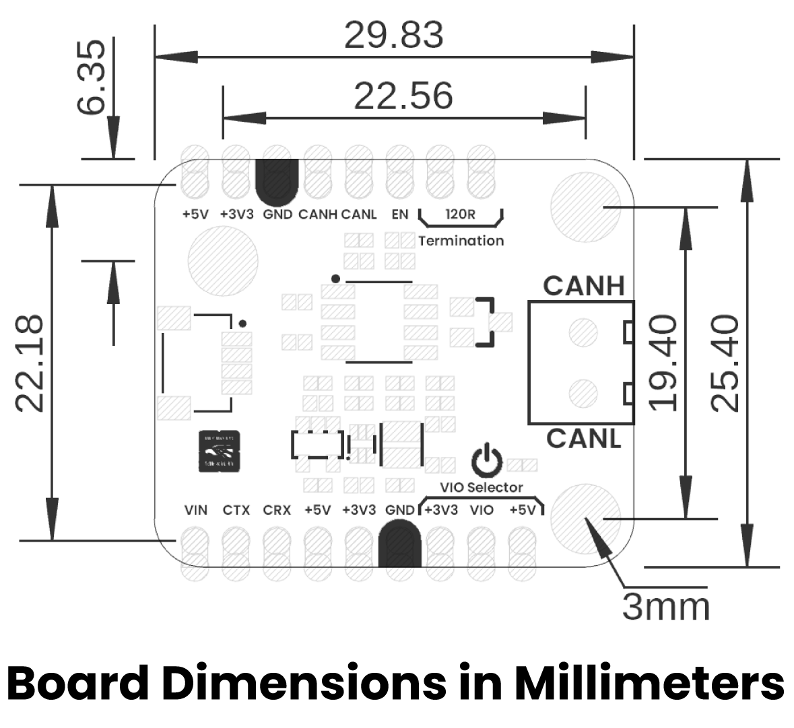

# Hardware

<a href="./unit_schematic_v_1_0_ue0085_TCAN1051HVD.pdf">  Schematics</a>

## 🔌 Pinout

    <a href="#"> Pinout</a>
     
     
     
    

| Pin Label | Function    | Notes                             |
|-----------|-------------|-----------------------------------|
| VCC       | Power Supply| 3.3V or 5V                       |
| GND       | Ground      | Common ground for all components  |

## 📏 Dimensions

<a href="./resources/unit_dimensions_v_1_0_ue0085_TCAN1051HVD.png">  Dimensions</a>

## 📃 Topology

<a href="./resources/unit_topology_v_1_0_ue0085_TCAN1051HVD.png">  Topology</a>
 
 
 

| Ref. | Description                              |
|------|------------------------------------------|
| IC1  | CAN Transceiver                          |
| IC2  | AP2112K 3.3V Regulator                   |
| IC3  | TPS61023 5V Regulator                    |
| L1   | Power On LED                             |
| JP1  | 2.54 mm Castellated Holes                |
| JP2  | 2.54 mm Castellated Holes                |
| J1   | JST 1 mm pitch for CAN Data              |
| J2   | Terminal Screw Block for CAN Bus         |
| SB1  | Solder Bridge for VIO                    |

# References

- [{{datasheet_name}}]({{datasheet_url}})
